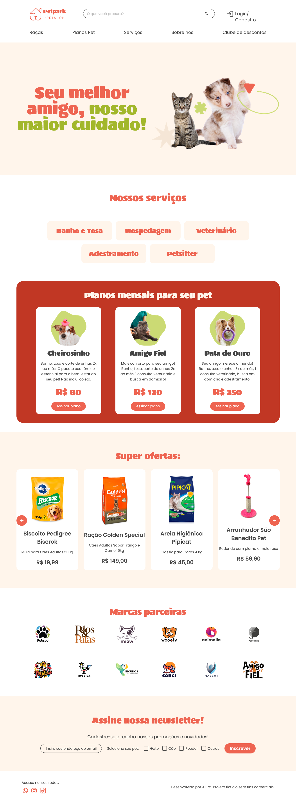
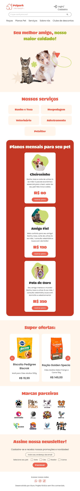
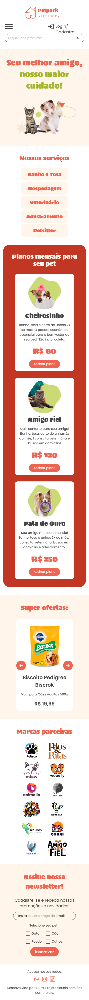

# petpark

A modern and responsive Pet Shop Website built with HTML, Tailwind CSS, and JavaScript.
The site provides a clean design and smooth interactivity for all devices, ensuring a great user experience on both desktop and mobile.

It includes multiple sections that highlight the shop’s services, promotions, partner brands, and a newsletter subscription area — everything a professional pet shop website needs.

---

## ✨ Features

- Responsive Layout: Built with Tailwind CSS for adaptability across all screen sizes.

- Mobile Menu: Interactive navigation menu optimized for mobile devices.

- Scroll Drag Interaction: Smooth horizontal scrolling with drag support for all devices.

---

## 🚀 Technologies

This project was developed with the following technologies:

- HTML
- Tailwind
- JavaScript

---

## 📷 Screenshots

### Desktop


### tablet


### mobile


---

## 📦 How to use

1. Clone the repository:
```bash
git clone https://github.com/michaelprocha/petpark.git
```

2. Run it through a local server (for example, using VS Code Live Server extension).

---

## 👨‍💻 Author

Made by [Michael Rocha](https://github.com/michaelprocha)

---

## 📄 License

This project is licensed under the MIT License. See the LICENSE file for more details.